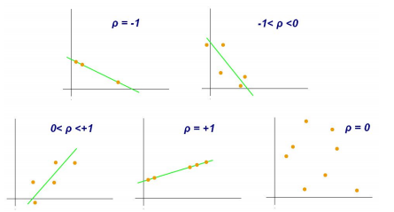
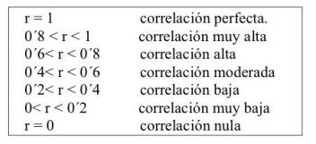

      
 
      <h1 style="">Pair Coding</h1>
       
    

El método conocido como pair programming (en español, programación en pareja) se
utiliza principalmente en el desarrollo ágil de software y, más concretamente, en la
programación extrema (XP). El pair programming especifica que siempre hay dos
personas trabajando al mismo tiempo en el código y que, en la medida de lo posible, se
sienten juntas. Una se encarga de escribir el código y la otra de supervisar en tiempo real.
Al mismo tiempo, están constantemente intercambiando impresiones: debaten problemas,
encuentran soluciones y desarrollan ideas creativas.

Por lo general, a estos dos trabajadores se les asignan diferentes roles: el programador al
que se le ha asignado el rol de piloto se encarga de escribir el código. El programador al
que se le ha asignado el rol de copiloto se encarga de supervisar ese código. Una de las
reglas del pair programming establece que estos dos roles se intercambien con
regularidad (a intervalos cortos). De esta manera se evita una posible brecha jerárquica:
se fomenta la igualdad entre ambos trabajadores y se consigue un intercambio fluido de
roles.

      
 
      
       
    
   

Además, lo ideal es que el espacio de trabajo también se adapte a los requisitos
específicos del pair programming. Cada trabajador deberá tener su propio ratón, teclado y
pantalla, en la que se mostrará siempre la misma información que en la del compañero.
Algo menos habitual es el método denominado remote pair programming. En este caso,
los programadores no se sientan juntos, sino que están ubicados en lugares
completamente diferentes. Para que este método funcione, se debe contar con soluciones
técnicas especiales. Aun a pesar de la distancia, los compañeros deben tener una línea
de comunicación directa y deben poder acceder al código y visualizar las modificaciones
en tiempo real.

      
 <h1 style="">Correlacion de Parson</h1> 
    

El coeficiente de correlación de Pearson es una prueba que mide la relación estadística
entre dos variables continuas. Si la asociación entre los elementos no es lineal, entonces
el coeficiente no se encuentra representado adecuadamente.
El coeficiente de correlación puede tomar un rango de valores de +1 a -1. Un valor de 0
indica que no hay asociación entre las dos variables. Un valor mayor que 0 indica una
asociación positiva. Es decir, a medida que aumenta el valor de una variable, también lo
hace el valor de la otra. Un valor menor que 0 indica una asociación negativa; es decir, a
medida que aumenta el valor de una variable, el valor de la otra disminuye.
Para llevar a cabo la correlación de Pearson es necesario cumplir lo siguiente:

* La escala de medida debe ser una escala de intervalo o relación.
* Las variables deben estar distribuidas de forma aproximada.
* La asociación debe ser lineal.
* No debe haber valores atípicos en los datos.

      
 
      
       
    
   

 Interpretación del coeficiente de correlación de Karl Pearson
El coeficiente de correlación de Pearson tiene el objetivo de indicar cuán asociadas se
encuentran dos variables entre sí por lo que:

Correlación menor a cero: Si la correlación es menor a cero, significa que es negativa, es
decir, que las variables se relacionan inversamente.
Cuando el valor de alguna variable es alto, el valor de la otra variable es bajo. Mientras
más próximo se encuentre a -1, más clara será la covariación extrema. Si el coeficiente es
igual a -1, nos referimos a una correlación negativa perfecta.

Correlación mayor a cero: Si la correlación es igual a +1 significa que es positiva perfecta.
En este caso significa que la correlación es positiva, es decir, que las variables se
correlacionan directamente.
Cuando el valor de una variable es alto, el valor de la otra también lo es, sucede lo mismo
cuando son bajos. Si es cercano a +1, el coeficiente será la covariación.
Correlación igual a cero: Cuando la correlación es igual a cero significa que no es posible
determinar algún sentido de covariación. Sin embargo, no significa que no exista una
relación no lineal entre las variables.

      
 
      
       
    
   

Cuando las variables son independientes significa que estas se encuentran
correlacionadas, pero esto nos significa que el resultado sea verdadero.

